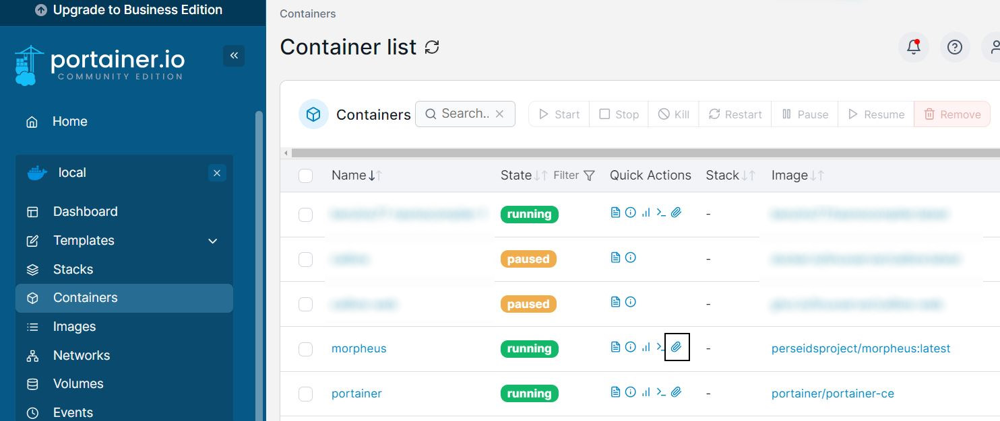

# Running Morpheus in a Docker container

In the setup for this project, a Docker container was used to run [Morpheus](https://github.com/perseids-tools/morpheus/) in a virtualized environment. There are various possible ways to implement such a container on a Synology NAS environment, which might also depend on your hardware type and DSM version. Good general guidance on using Docker with Synology can be found online; for example, see [Marius Hosting](https://mariushosting.com/docker/). Some screenshots of my own configuration (DS420+ with DSM 7.2.2), which might be also helpful, are provided later on this page.

# Creating or obtaining the Morpheus image

The exact steps to follow highly depend on your environment and specific use case. Good starting points include:

  - [pereid-tools Docker info on GitHub](https://github.com/perseids-tools/morpheus/blob/master/Dockerfile) (esp. if you want to build yourself)

  - [docker.com](https://www.docker.com)

Initially, I used the following: [registry.hub.docker.com](https://registry.hub.docker.com/r/perseidsproject/morpheus/tags) (when using pre-build container). Since this image does not have an API, the interaction with Morpheus is done by running local scripts. To allow for smooth transfer of files between the container and the host environment, which in my case was the Synology NAS, I mounted a specially created directory in DSM's FileStation to the container.

Note: 
> During the project, I switched to another [image which provided an API as well](https://hub.docker.com/r/perseidsproject/morpheus-api/). This simplified the workflow, especially after I developed a dedicated Python package [morphkit](https://tonyjurg.github.io/morphkit/) to interface with Morpheus directly from within a Jupyter Notebook.

The rest of this page describes the original (non-API) setup. The local script scenario might still be the best option in certain cases where using the API is slow or the number of allowed lookups is capped.

# Using Morpheus 

This process consists of three stages:

## Data preparation

The first step is to prepare a list of unique wordforms in the N1904 Greek New Testament. This was done in this [Jupyter Notebook](x), in which I used feature [betacode](https://tonyjurg.github.io/N1904addons/features/betacode.html) from my TF addition [N1904addons](tonyjurg.github.io/N1904addons/). The output is a text file with each transferred betacode word in N1904 GNT; one per line.

## Morphological analysis

The text file is then transfered to the docker container where it was used as input to a Bash script which can be found [here](bash_script.md). All results (succesfull or failure) are then stored in another text file. 

## Post processing

The resulting text file with the analysis results is then transfered back to the computer and used as input to another [Jupyter Notebook](). This notebook creates a JSON file with an easy to access presentation of the results.

# Morheus in Docker on Synology NAS

The following images show some of the more important configuration details of a Morpheus Docker container on Synology using Container Manager and Portainer.

**The container**

**Portainer** (allows for easier fine-tuning)

**File Station** (for defining the shared drive)

**Container settings** (in portainer to mount the shared drive)

**Attaching terminal** (in portainer to start scripts, etc)

# Other (abandoned) configurations

Another options would have been to install an SSH daemon on the Docker container, which would allow for remote execute of commands on the container by scripts located elsewhere on the network. An SSH deamon could successfully be installed *on the docker image* and its port exposed externally on the Synology. This would allow for the creation of a Jupyter Notebook on the host computer interacting with this port (by using the Python `paramiko` library for [managing SSH sessions](connect_with_ssh.md)). This approach would be beneficial if interactive lookups were required. However, in this case just a single batch operation was required, so I've abandoned this avenue.
